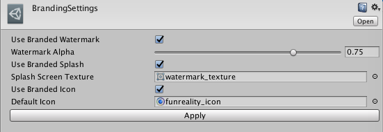

# Funreality Branding Setup

## Информация

Текущая версия - 0.1.0

Репозиторий - [ssh://git@git.evolenta.ru:2202/reusable\_plugins/FunrealityBrandingSetup.git](ssh://git@git.evolenta.ru:2202/reusable_plugins/FunrealityBrandingSetup.git)


Использовать только для разработки плагина. Для интеграции в проект - использовать package


UnityPackage -

## Возможности:

* Автоматическое добавление водяного знака
* Автоматическая настройка сплеш-скрина
* Автоматическая настройка иконки приложения

## Использование

1. Импортировать в проект unitypackage
2. Перейти в меню настроек Funreality/BrandingSettings

## Настройки:

* Use Branded Watermark - использовать водяной знак или нет
* Watermark Alpha - прозрачность
* User Branded Splash - использовать брендированный сплэшскрин
* Splash Screen Texture - текстура сплэшскрина
* User Branded Icon - использовать берндированную иконку?
* Default Icon - иконка приложения по умолчанию

